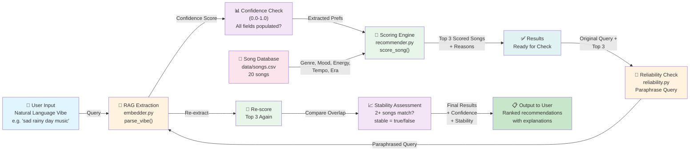

# VibeMatch System Architecture Diagram

## Data Flow Explanation

1. **User Input (Blue)** — Natural language query describing musical vibe
2. **RAG Extraction (Orange)** — Claude LLM extracts structured attributes (genre, mood, energy, tempo_bpm, era) from free-text query
3. **Confidence Check (Purple)** — Measures what fraction of attributes were successfully extracted (0.0-1.0)
4. **Scoring Engine (Green)** — Original Project 3 weighted scorer matches extracted attributes against song database
5. **Song Database (Pink)** — 20-row CSV with titles, artists, and metadata
6. **Results Ready (Teal)** — Top 3 songs with explanations of why they matched
7. **Reliability Check (Orange)** — Paraphrases original query and reruns the full pipeline
8. **Re-score (Green)** — Extracts attributes from paraphrase and scores again
9. **Stability Assessment (Purple)** — Compares two top-3 lists; if 2+ songs overlap, result is marked stable=true
10. **Final Output (Green)** — User receives recommendations with confidence and stability scores

## Key Design Decisions

- **Modular Layers**: Each component (extraction, scoring, reliability check) is independent and testable
- **Confidence as Quality Signal**: Guides downstream decisions (show results vs. ask for clarification)
- **Paraphrase-Based Reliability**: Tests consistency without needing ground truth labels or human evaluation
- **Explainability**: Every recommendation includes per-attribute scoring reasons (why this song matched)
